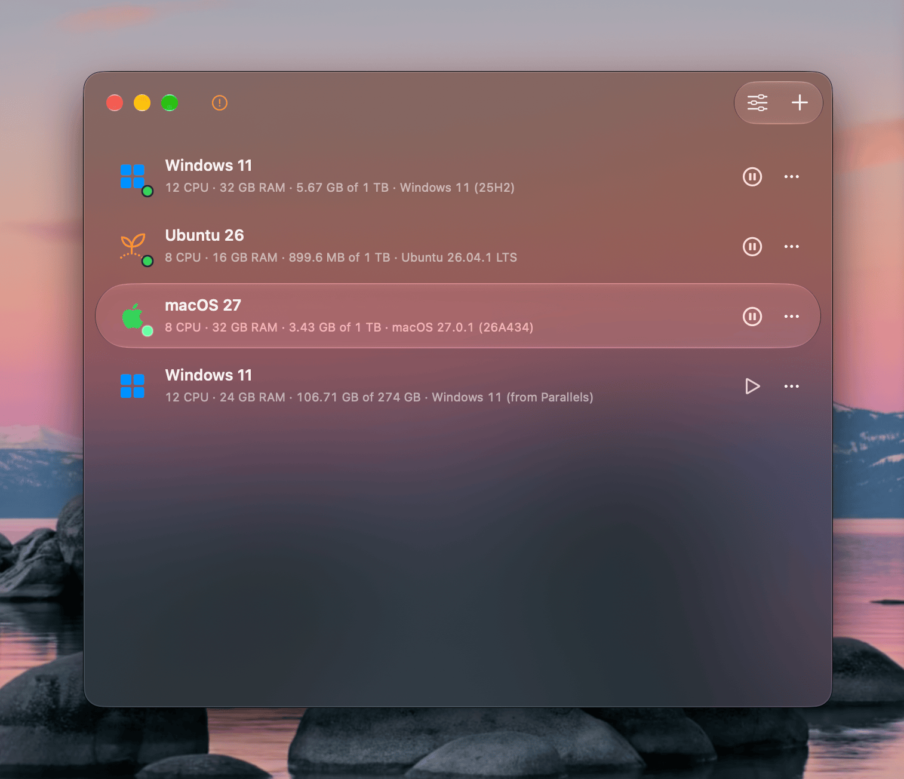
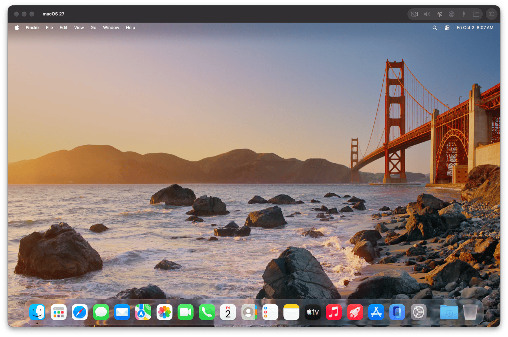
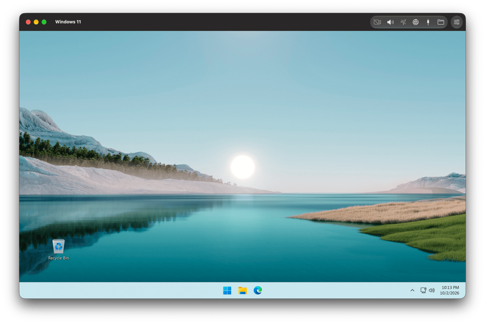
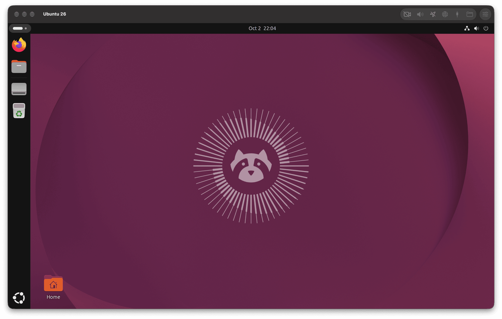

<h2 align="center">VMPal</h2>
<h3 align="center">Fast macOS, Windows and Linux Virtual Machines for Apple Silicon</h3>

    
    
    

 

<h4 align="center">
    <u>
        This repository is the official issue & bug tracker of VMPal for macOS
    </u>
</h4>

 

<pre align="center">
VMPal is a native app that runs virtual machines on your
Apple silicon Mac, each in its own window. A new VM starts
from a base OS and takes almost no space until you use it

Supports macOS, Windows 11 for Arm, Ubuntu and Fedora,
and imports your VMs from Parallels Desktop
</pre>

 

<h3 align="center">As excited as we are?</h3>
<h4 align="center">Check out VMPal in action:</h4>

<h4 align="center">macOS</h4>

<h4 align="center">Windows</h4>

<h4 align="center">Linux</h4>

 

<h3 align="center">Found a bug?</h3>

<h4 align="center">
    <a href="https://github.com/TablePlus/VMPal-issue-tracker/issues/new/choose">Open an issue</a>
    and attach your VM's log, so we can see what happened
</h4>

### Sending us a log

When a VM crashes, stops with an error or won't start, its log tells us why.

1. In VMPal, select the VM and choose **Help › Show Logs in Finder**. Finder opens with its log selected.
2. Drag the log into your issue's comment box, or email it to [nick@tableplus.com](mailto:nick@tableplus.com) with your issue's link.

If VMPal or a VM quit unexpectedly, also choose **Help › Show Crash Reports in Finder**. Choose **File › Compress** in Finder and attach the `.zip`.

A log can include your VM's name and the names of files on your Mac. If you'd rather not post it publicly, email it.

 

<h3 align="center">Thank you for trying VMPal</h3>

<h4 align="center">
    We would be thrilled if you
    <a href="https://vmpal.com/pricing">purchased a license</a>
    to support development!
</h4>

 
 

    VMPal Team |
    <a href="mailto:nick@tableplus.com">nick@tableplus.com</a>

    
    

